# Описание проекта
Проект представляет собой Spring Boot приложение, написанное на Java и использующее Maven для автоматизации сборки.

Основное назначение приложения - создание и прослушивание kafka топика, конфигурация консьюмера и продьюсера, и вывод сообщений в терминал.

Для работы с Kafka использовалась библиотека spring-kafka (org.springframework.kafka).

Для создания образа используется Dockerfile, который разворачивается с помощью Docker Compose.

Помимо Java приложения в Docker Compose конфигурируются такие сервисы как Apache NiFi и Apache Hadoop.

Apache NiFi принимает поток данных из топика Kafka, модернизирует входные сообщение и сохраняет обновленный JSON в Apache Hadoop.

# 1. Развёртывание и настройка Kafka-кластера в Yandex Cloud

## Kafka кластер:

В рамках проекта в Yandex Cloud был развернут Kafka кластер состоящий из 3 брокеров, работающих в комбинированном режиме
в качестве брокеров и контроллеров. 

 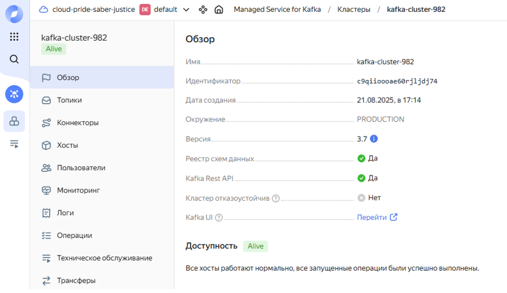

 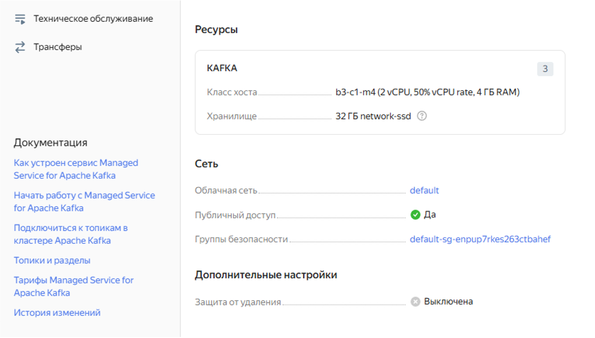

 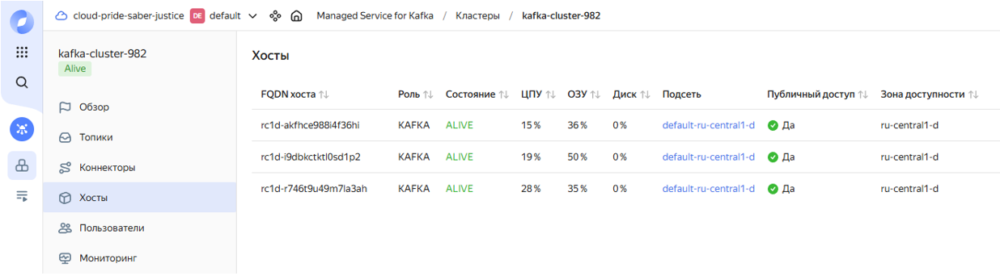

 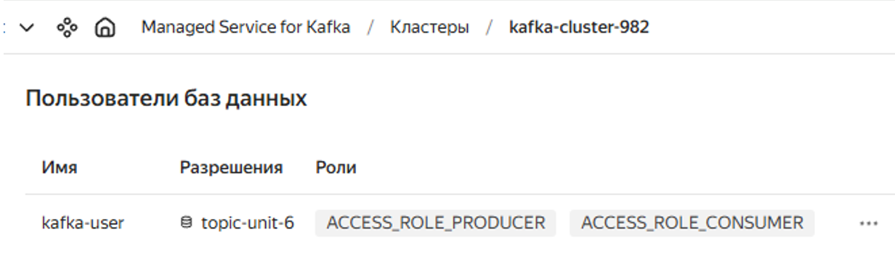

Кластер не является отказоустойчивым, так как хост брокер присутствует только в одной из зон доступности. Такой подход 
выбран намерено, чтобы сэкономить выделенный грант. В реальном продакшене следовало не использовать комбинированный режим,
это позволило бы присутствовать на всех зонах доступности, тем самым обеспечивая отказоустойчивость. По причине экономии
так же была выбрана конфигурация машины с типом Burstable - ВМ с неполной гарантированной долей vCPU.

## Конфигурация топика:

 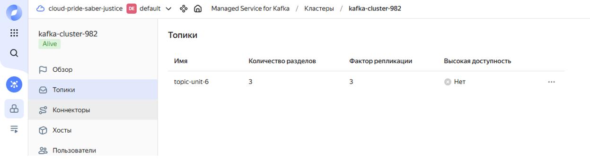

 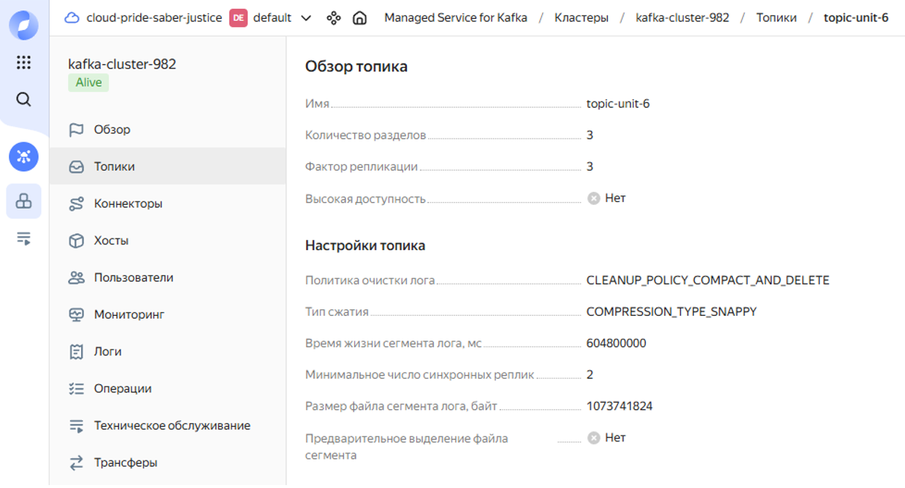

Скриншот ответа вызова curl http://localhost:8081/subjects и curl -X GET http://localhost:8081/subjects/<название_схемы>/versions

 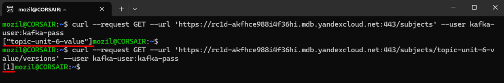

Вывод команды kafka-topics.sh --describe. Удобный формат для просмотра представлен в файле [topic_describe.json](/logs/topic_describe.json)

 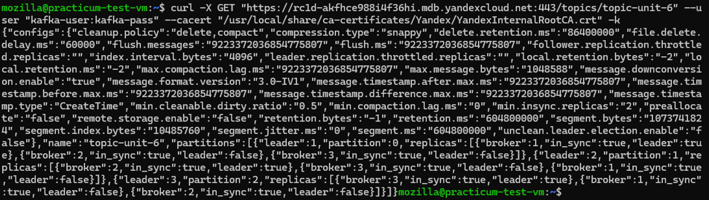

Файл схемы для Schema Registry представлен в файле [Notification.avsc](/src/main/resources/Notification.avsc)

## Скриншоты, подтверждающие успешную передачу и чтение сообщений:

 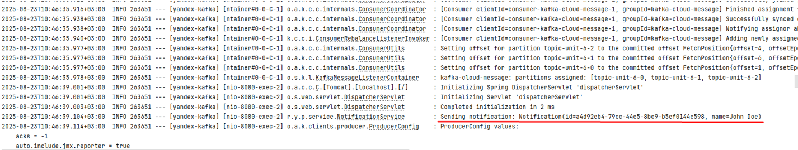

 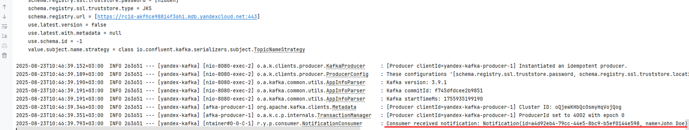

 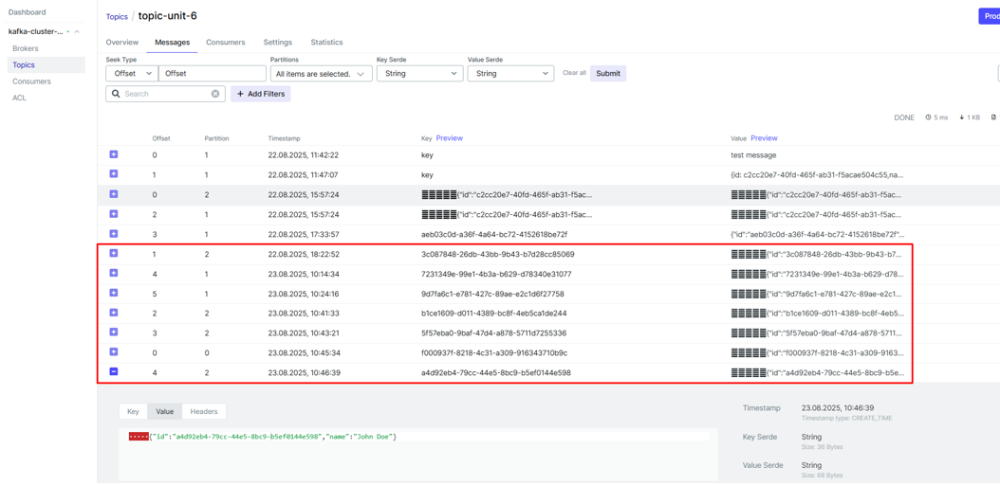

# 2. Интеграция Kafka с внешними системами Apache NiFi / Hadoop

## Схема Flow

 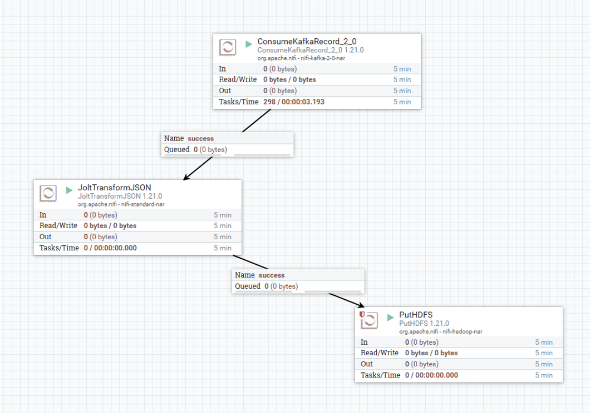

## Конфигурация ConsumeKafkaRecord_2_0 процессора:

 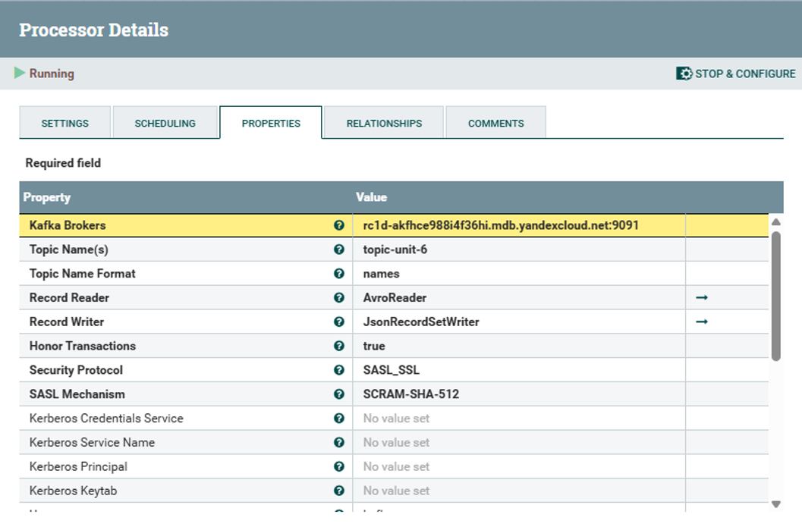

## Конфигурация JoltTransformJSON процессора:

 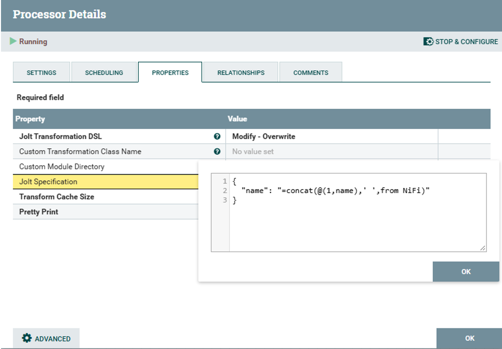

## Конфигурация PutHDFS процессора:

 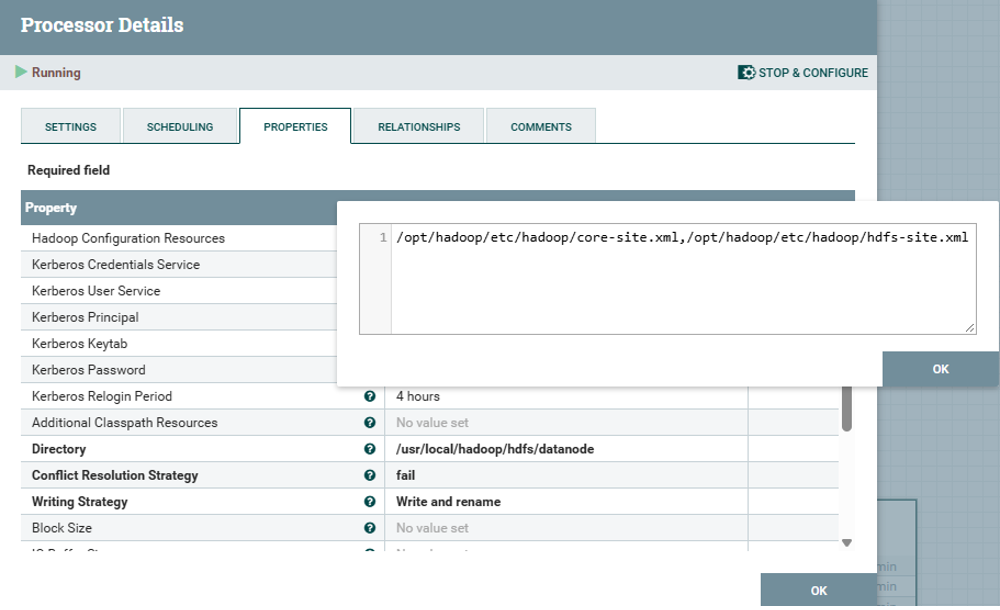

## NiFi Flow Configuration:

 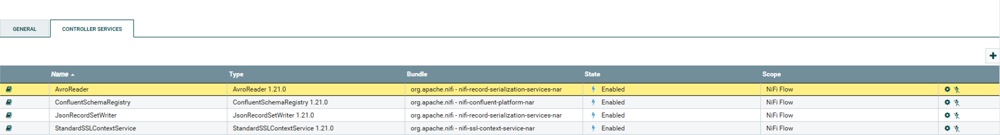

## Скриншоты, подтверждающие модернизацию и запись сообщений в Hadoop:

 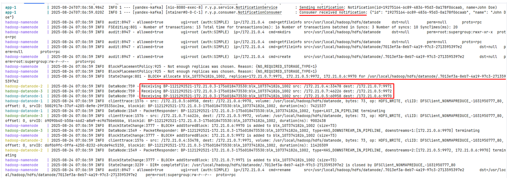

 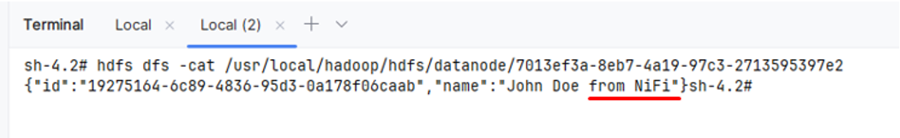

