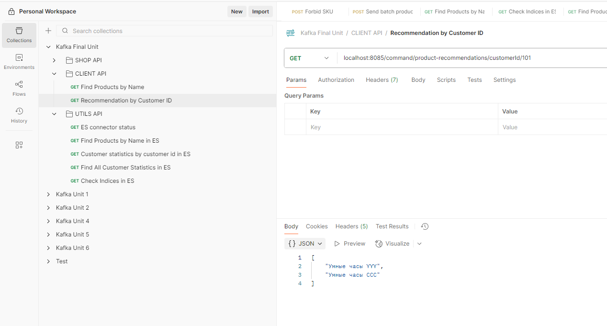
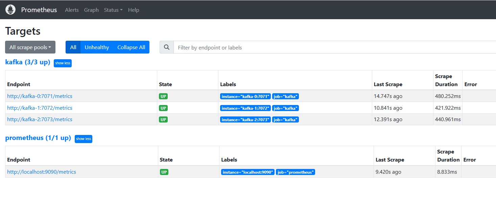
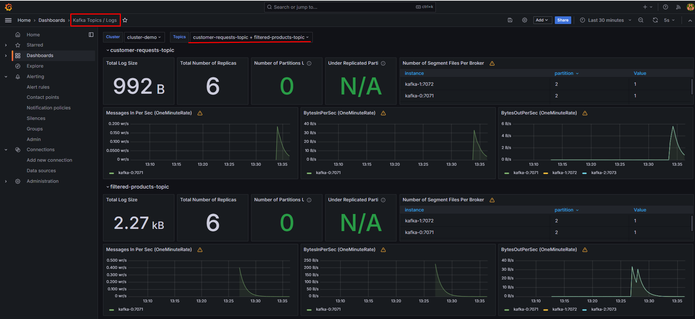
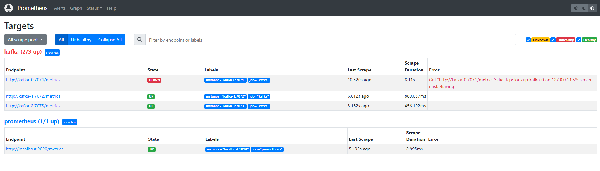
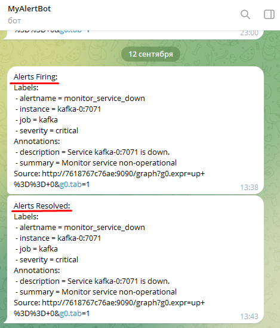

# Описание проекта
Проект представляет собой Spring Boot приложение, написанное на Java и использующее Maven для автоматизации сборки.

Основное назначение приложения - создание kafka топиков, конфигурация коннектора для elasticsearch, эмуляция shop api и client api, 
обработка действий пользователя и составление статистики.

Для создания образа используется Dockerfile, который разворачивается с помощью Docker Compose.

Помимо Java приложения в Docker Compose конфигурируются такие сервисы как Apache NiFi, Apache Hadoop, Spark, Kafka Connect,
Prometheus, Grafana, Alertmanager, Elasticsearch.

# 1. Инструкция по запуску

Выполнить команду из корня проекта:
```
docker compose up
```

После сборки и запуска убедиться, что все сервисы имеют статус UP (кроме утилитарных kafka-common-cluster)
```
docker ps -a
```
<p>
 
</p>

В рамках проекта развернуты два Kafka кластера состоящие из 3 брокеров, работающих в комбинированном режиме
в качестве брокеров и контроллеров.

Брокеры общаются между собой и принимают внешние подключения по секьюрити протоколу SASL_SSL, отвечающий за аутентификацию,
который добавляет слой безопасности к соединению. Способ аутентификации был выбран: SASL/PLAIN.
Учётные данные хранятся в файле конфигурации Kafka (jaas.conf).

<p>
 
</p>

<p>
 
</p>

## Kafka кластер:

Зайдя на страницу Kafka UI для первого кластера (http://localhost:8080) можно убедиться, что необходимые для работы топики
созданы автоматически Java приложением.

<p>
 
</p>

Остальные топики служат для работы schema-registry и репликации данных через Mirror Maker 2. Если зайти на страницу Kafka UI
для второго кластера (http://localhost:8082) можно убедиться в наличии топика, хранящего действия пользователя для последующей
аналитики, которые будут реплицироваться с первого кластера.

<p>
 
</p>

В рамках первого кластера были настроены необходимые ACL правила, чтобы ограничить доступ к топикам неавторизованным пользователям.

<p>
 
</p>

Файлы схем для Schema Registry представлены в файлах [Product.avsc](/yandex-practicum-common/src/main/resources/Product.avsc)
и [CustomerRequest.avsc](/yandex-practicum-common/src/main/resources/CustomerRequest.avsc)

<p>
 
</p>

## Конфигурация Apache NiFi:

Для дальнейшей работы необходимо настроить Flow в Apache NiFi. Сначала перейдем по ссылке http://localhost:9080/nifi.
Далее необходимо загрузить подготовленный темплейт.

<p>
 
</p>

<p>
 
</p>

Следующий шаг будет включение всех controller services во вкладе NiFi Flow Configuration.

<p>
 
</p>

Это необходимо для успешного запуска всех NiFi процессоров. Зеленый знак "play" указывает на то, что оба процессора
настроены и готовы к работе.

<p>
 
</p>

Процессор ConsumeKafkaRecord_2_0 слушает топик customer-requests-topic из второго кластера, куда будут реплицироваться
пользовательские запросы из первого кластера. В формате json эти запросы попадают в процессор PutHDFS, где они будут
сохранены в системе Hadoop. Затем java приложение с запущенным инструментом Spark раз в 30 секунд проверяет новые записи,
выгружает их и анализирует для составления статистики (группировка идет для каждого кастомера).


# 2. Проверка работоспособности

Все эндпоинты представлены в Postman коллекции [Kafka Final Unit.postman_collection.json](/Kafka%20Final%20Unit.postman_collection.json)

## Потоковая обработка данных

Система проверяет, не входят ли товары магазинов в список запрещённых. 
Для этого была настроена потоковая обработка данных с помощью библиотеки Kafka Streams.

С помощью следующего api можно настроить список запрещенных товаров. Блокировка идет по полю sku.

```
POST http://localhost:8085/forbiddenSku 
```
<p>
 
</p>

Воспользуемся следующим api, чтобы отправить несколько продуктов, один из них будет содержать запрещенный sku

```
POST http://localhost:8085/product/batch
{
    тело продукта
}
```

<p>
 
</p>

С помощью Kafka Streams мы получаем поток данных из топика products-topic, проверяем и сравниваем sku для каждого продукта со списком
запрещенных, фильтруем и отправляем в топик filtered-products-topic.

<p>
 
</p>

В дополнении к этому мы можем проверить, что наши отфильтрованные данные не только успешно сохранены в топике Kafka, но
и с помощью Kafka Connect попали в нашу базу данных (за нее отвечает Elasticsearch).

Для этого можно воспользоваться следующим запросом

```
GET http://localhost:9200/filtered-products-topic/_search
{
    "query": {
        "match_phrase": {
            "name": {
                "query": "часы"
            }
        }
    }
}
```

<p>
 
</p>

Также мы можем воспользоваться следующим запросом

```
GET http://localhost:9200/_cat/indices?v
```

<p>
 
</p>

## Проверка аналитической системы

Воспользуемся client api, чтобы эмулировать поиск пользователем какого-либо продукта в системе

```
GET http://localhost:8085/command/product-search/часы/customerId/101
```

Айди кастомера может быть любой, но важно помнить, что именно по этому идентификатору будет произведен расчет статистики
и выдача рекомендаций.

<p>
 
</p>

Велью для параметра product-search не ограничен. Мы можем искать ранее сохраненные продукты как по слову "часы",
так и "XXX", "Умные часы" и т.д.

Перед получением рекомендаций имеет смысл сделать несколько запросов и затем проверить то, что было сохранено в ElasticSearch.

Как уже было описано выше, все реквесты от кастомера сперва попадают на первый кластер в топик customer-requests-topic.
Затем с помощью Mirror Maker 2 данные реплицируется на второй кластер в тот же самый топик. NiFi слушает его и передает
данные в Hadoop, который сохраняет все полученные сообщения в виде файлов. Каждые 30 секунд Spark вытягивает данные из Hadoop.
Важно отметить, что обработаны будут только новые файлы, уже анализированные файлы не участвует в составлении статистики.
Данные группируются по кастомер айди, а система подсчитывает сколько раз пользователь интересовался тем или иным продуктом. 
Затем система получает из Elasticsearch предыдущую статистику для кастомера и дополняет ее, затем перезаписывает сообщение в
Elasticsearch.

Пример получения статистики для конкретного кастомера представлен ниже.

```
GET http://localhost:9200/customer-statistics/_doc/101
```

<p>
 
</p>

Теперь мы можем получить рекомендации на основе этих данных выполнив следующий запрос

```
GET http://localhost:8085/command/product-recommendations/customerId/101
```

<p>
 
</p>

По текущей настройке пользователю выдается топ 2 продукта, которыми он интересовался чаще всего.

## Мониторинг

Для сбора метрик с наших брокеров Kafka был настроен и поднят jmx exporter. Он не только собирает метрики для последующего
отображения их в Grafana, но и служит индикатором того, жив ли конкретный брокер.

За их статусом работы можно следить, перейдя по ссылке http://localhost:9090/targets?search=

<p>
 
</p>

Все метрики из jmx exporter поступают в Prometheus, а с помощью настроенных дашбордов Grafana выдает их визуальное представление.

<p>
 
</p>

В дополнение к этому был поднят и настроен Alertmanager, задача которого при падении одного из брокеров послать нотификацию
в telegram бот.

<p>
 
</p>

<p>
 
</p>